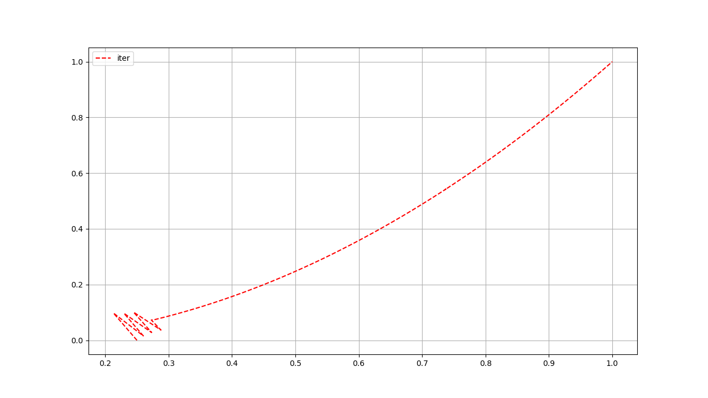

# 第一章作业总结

1. 目标函数,根据代码编写习惯进行改写

   $$
   f(X)=f(x_0, x_1, ...,x_{N-1})=\sum_{i=0}^{N/2}[100(x_{2i}^2-x_{2i+1})^2+(x_{2i}-1)^2]
   $$
2. Armijo condition

   $$
   \tau \in \{\alpha|f(x^k)-f(x^k+\alpha d) \geqslant -c * d^T \Delta f(x^k)\}
   $$

   
3. 将公式展开，方便进行梯度计算

   $$
   f(X) = \sum_{i=0}^{N/2}[100*x_{2i}^4 - 200x_{2i}^2 * x_{2i+1}+100x_{2i+1}^2 + x_{2i}^2-2*x_{*i}]
   $$
4. 目标函数与梯度计算图

   
5. 优化结果设置

   
6. 迭代结果图

   
7. 使用绘图需要安装 sudo apt-get install libpython3-dev
